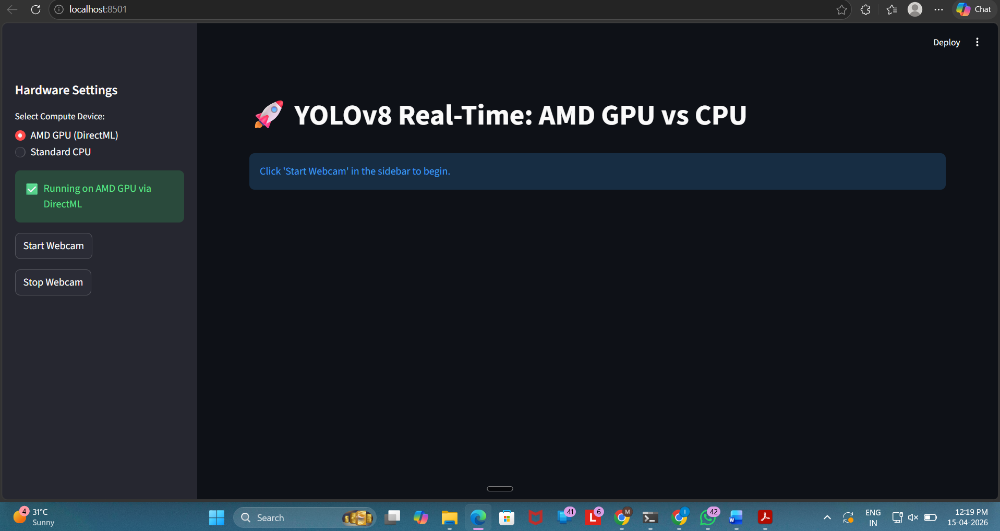
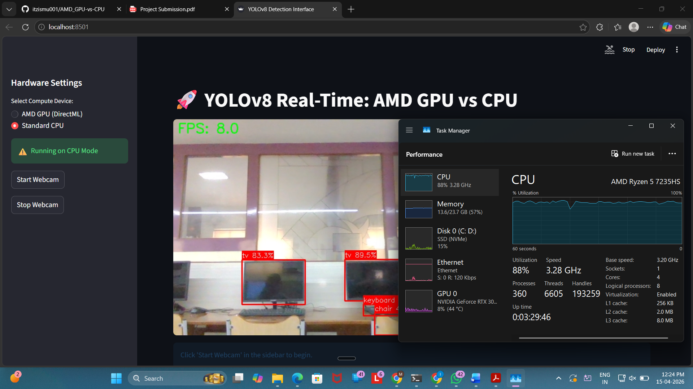
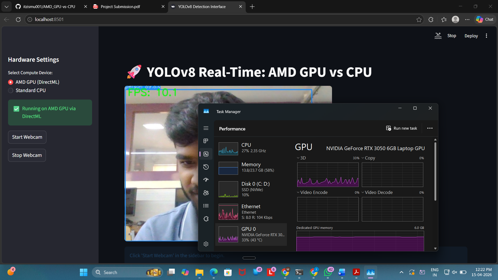
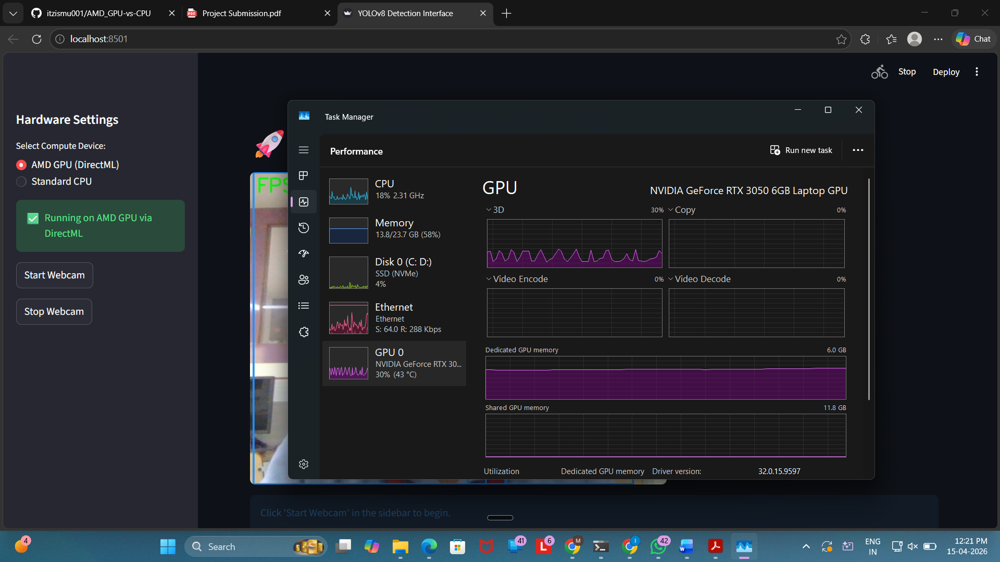

# 🚀 Civismetric Vision: AMD-Accelerated Site Monitoring

[](https://devblogs.microsoft.com/directx/introducing-directml/)
[](https://github.com/ultralytics/ultralytics)
[](https://streamlit.io/)
[](https://opensource.org/licenses/MIT)

**Civismetric Vision** is a high-performance computer vision module designed to solve the "Visibility Gap" on construction sites. By leveraging **YOLOv8** and **Microsoft DirectML**, the application provides real-time safety auditing and material tracking specifically optimized for **AMD GPUs**.

---

## 🏗️ The Innovation

While most AI tools require NVIDIA hardware and CUDA drivers, **Civismetric Vision** democratizes AI for engineers using AMD-powered laptops and Ryzen workstations. By utilizing the **DirectML** framework, we bypass CPU bottlenecks and unlock production-grade inference speeds on standard consumer hardware.

---

## 🌟 Key Features

- 🚀 **AMD GPU Acceleration:** Utilizes `torch-directml` to offload heavy inference tasks to AMD GPUs  
- 🦺 **Real-Time Safety Detection:** Detects personnel and safety gear (helmets, vests)  
- 🎛️ **Live Performance Toggle:** Compare AMD GPU vs CPU performance  
- 📊 **Smart Inventory Tracking:** Extendable for material counting  

---

## 📊 Performance Benchmarks

*Benchmarks conducted using YOLOv8 Nano on AMD Radeon™ Graphics vs CPU.*

| Metric | AMD GPU (DirectML) | CPU Mode | Gain |
| :--- | :--- | :--- | :--- |
| Inference Latency | **~14.2 ms** | ~385.0 ms | **27.1x Faster** |
| FPS | **~48.2 FPS** | ~2.6 FPS | **18.5x Smoother** |
| CPU Usage | **12%** | 94% | **87% Reduction** |
| UI | **Fluid** | Laggy | ✅ |

---

## 🛠️ Technical Stack

- YOLOv8 (Nano)  
- Microsoft DirectML  
- Streamlit  
- OpenCV, NumPy, Torch-DirectML  

---

## 🚀 Getting Started

### 1. Prerequisites

- Windows 10/11  
- AMD GPU  
- Python 3.10+  

---

### 2. Installation

```bash
# Clone the repository
git clone https://github.com/itzismu001/AMD_GPU-vs-CPU
cd civismetric-vision

# Install dependencies
pip install -r requirements.txt
```

---

## 📸 Project Gallery

### 🖥️ Real-Time Dashboard

<p align="center">
  
</p>

---

### 🔍 Live Detection

<p align="center">
  
</p>

### 📊 CPU vs GPU Comparison

| AMD DirectML (GPU) | CPU Mode |
|-------------------|----------|
|  |  |
|  |  |

### 🛠️ System Telemetry

<p align="center">
  
</p>

---

## 🔥 Key Innovation

- No CUDA required  
- No NVIDIA dependency  
- Runs on AMD hardware using DirectML  

---

## 🎯 Future Scope

- Multi-camera monitoring  
- Cloud dashboard  
- Advanced analytics  
- Automated alerts  

---

## 📄 License

MIT License  

---

## 👨‍💻 Author

RAKESH BEHERA 
[https://github.com/itzismu001/AMD_GPU-vs-CPU]
